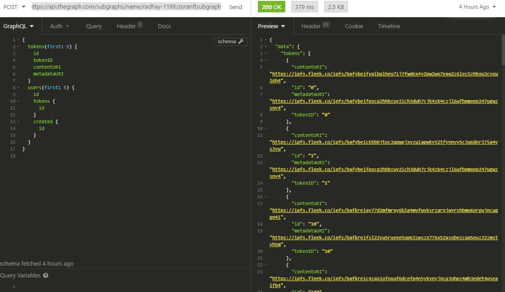

# subgraph-zoranft
subgraph using the Zora NFT smart contract

Implementation of the subgraph for querying NFT data from the Zora Smart Contract using Graphql, 
Implementing queries for fetching NFTs as well as their owners, and building relationships between them.

Graphql Api:https://api.thegraph.com/subgraphs/name/radhay-1199/zoranftsubgraph
\
\
Here's a sample of the resultant emails:

